 

&nbsp;
&nbsp;
&nbsp;

## About

I build back-end services for systems where being wrong is expensive — payment integration for Bank Misr, multi-tenant enterprise APIs on Oracle, and a national food-subsidy platform. That shapes how I work: I reproduce a problem before I change anything, and I write a test that proves it is fixed.

My focus is **API security** — OAuth2 and OpenID Connect, JWT issuance and validation, role- and permission-based access control, and multi-tenant isolation. Most of that work is public below, with the design decisions written down.

<b>What I work on</b>

 

- **Secure REST APIs** — Spring Boot services with validation, consistent error contracts, OpenAPI documentation, and tests that exercise the real security filter chain
- **Authentication and authorization** — OAuth2 / OIDC authorization servers, JWT with JWKS-based verification, refresh-token rotation, key and secret rotation without downtime
- **Multi-tenant systems** — tenant isolation enforced at both authentication and authorization, so a valid token from one tenant cannot read another's data
- **Microservices** — service discovery, centralized configuration, API gateways, event-driven messaging over Kafka
- **Enterprise and legacy Java** — Java EE, JSF/PrimeFaces and Oracle systems, including incremental modernization toward Spring Boot

## Tech Stack

<b>Full stack as text</b>

 

| | |
|---|---|
| **Languages** | Java (8 / 11 / 17 / 21), SQL |
| **Frameworks** | Spring Boot, Spring Security, Spring Data JPA, Spring Cloud, Spring Authorization Server, Hibernate |
| **Security** | OAuth2, OpenID Connect, JWT / JWKS, PKCE, RBAC, multi-tenancy |
| **Data** | PostgreSQL, Oracle, MySQL, MongoDB, Redis, Flyway |
| **Messaging** | Apache Kafka |
| **Testing** | JUnit 5, Mockito, Testcontainers, MockMvc, WebTestClient, WireMock |
| **Tooling** | Docker, Docker Compose, Maven, Git, OpenAPI / Swagger, Actuator |
| **Legacy** | Java EE, JSF / PrimeFaces, WebLogic, Apache POI |

Oracle, WebLogic and the legacy stack come from professional work rather than public repositories.

## Projects

<b>AuthCore</b> — why replaying one refresh token revokes the whole family

 

When Spring Authorization Server rotates a refresh token it overwrites the old value, so by the time an attacker replays it there is nothing left to compare against. AuthCore records a hash of every issued refresh token along with its rotation lineage. When a consumed token reappears, the server cannot tell the thief from the victim — so it revokes the entire family and forces a fresh login.

Signing keys, client secrets and tokens can all be rotated or revoked while the server is running, without invalidating anything still legitimately in use.

<b>GateKeeper</b> — why the gateway is deliberately not the security boundary

 

It refuses traffic that obviously does not belong — missing, expired, or wrongly issued tokens — and strips any `X-GK-*` header a client tried to forge before stamping the verified identity. What it never does is decide what an authenticated caller may access.

A gateway that owns authorization becomes a single point whose compromise unlocks everything behind it. This one is built so that removing it weakens throughput, not security.

<b>ledger-service</b> — why it re-verifies tokens the gateway already checked

 

It verifies every JWT against AuthCore's published keys and derives the caller's tenant and permissions from the token itself. Headers stamped by the gateway are informational only.

A dedicated `whoami` endpoint reports header-asserted identity beside token-derived identity and flags any disagreement — showing in a single response why a header is never proof.

<b>E-commerce Microservices</b> — how order and payment stay decoupled from notifications

 

Eight services — customer, product, order, payment, notification, gateway, discovery and config server — register with Eureka and pull configuration centrally, behind a gateway that validates Keycloak-issued tokens.

Order and payment publish to `order-topic` and `payment-topic` on Kafka; the notification service consumes both, so neither waits on it. PostgreSQL, MongoDB, Kafka, Keycloak and Zipkin are all defined in one Docker Compose file.

<b>spring-boot-api-starter</b> — why 401s and 403s need their own error handler

 

`@RestControllerAdvice` never sees them: Spring Security rejects the request inside the filter chain, before the `DispatcherServlet` runs, so the default body is empty. A handler wired as both `AuthenticationEntryPoint` and `AccessDeniedHandler` gives every failure the same JSON shape.

The tests send real JWTs through the real filter chain rather than using `@WithMockUser`, which would leave the suite green even if token parsing broke entirely.

## Experience

**Java Back-End Developer** · Smart Digital Services · *Jan 2025 – present* 
Spring Boot microservices and enterprise Java for banking and government clients: a payment integration platform with Bank Misr, multi-tenant REST APIs on Oracle with organization-scoped isolation and audit trails, and maintenance of large Java EE / JSF systems, including modules for a national food-subsidy platform.

**B.Sc. Computer Engineering** · Helwan University · *2019 – 2024* 
**Java Spring Advanced** · Egyptian Banking Institute · *2024*

## Activity

<picture>
  <source media="(prefers-color-scheme: dark)" srcset="https://raw.githubusercontent.com/ezat141/ezat141/output/github-snake-dark.svg">
  <source media="(prefers-color-scheme: light)" srcset="https://raw.githubusercontent.com/ezat141/ezat141/output/github-snake.svg">
  
</picture>

## Contact

&nbsp;

  

Open to back-end roles and contract work in Java / Spring Boot — particularly API security and system integration.

